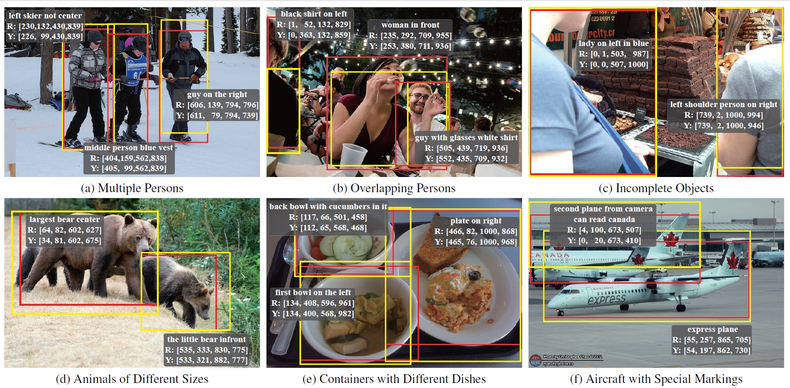

# ViLaM: A Vision-Language Model with Enhanced Visual Grounding and Generalization Capability

This repository is a PyTorch implementation of the vision-language model for visual grounding proposed in *ViLaM: A Vision-Language Model with Enhanced Visual Grounding and Generalization Capability* (submitted)

Some code in this repo is copied/modified from [BLIP2](https://github.com/salesforce/LAVIS).

## Experiments

> Evaluation results on visual grounding (RefCOCO, RefCOCO+ and RefCOCOg). Red indicates the method with the best indicators, and blue with the second-best. Acc@0.5 is applied to evaluate the performance of different methods. Three main types of visual grounding methods are used for comparison, namely two-stage, one-stage and generalist model.
> 
|                                           |  RefCOCO  |         |         |  RefCOCO+  |         |         | RefCOCOg |        |
|-------------------------------------------|:---------:|:-------:|:-------:|:----------:|:-------:|:-------:|:--------:|:------:|
| Models                                    |    val    |  testA  |  testB  |    val     |  testA  |  testB  |  val-u   | test-u |
| VILLA                                     |   82.39   |  87.48  |  74.84  |   76.17    |  81.54  |  66.84  |  76.18   | 76.71  |
| DGA                                       |   86.34   |  86.64  |  84.79  |   73.56    |  78.31  |  68.15  |  80.21   | 80.26  |
| CM-Att-Erase                              |   87.47   |  88.12  |  86.32  |   73.74    |  77.58  |  68.85  |  80.23   | 80.37  |
| NMTREE                                    |   85.65   |  85.63  |  85.08  |   72.84    |  75.74  |  67.62  |  78.57   | 78.21  |
| TransVG                                   |   81.02   |  82.72  |  78.35  |   64.82    |  70.70  |  56.94  |  68.67   | 67.73  |
| MDETR                                     |   86.75   |  89.58  |  81.41  |   79.52    |  84.09  |  70.62  |  81.64   | 80.89  |
| SeqTR                                     |   83.72   |  86.51  |  81.24  |   71.45    |  76.26  |  64.88  |  74.86   | 74.21  |
| VGTR                                      |   79.30   |  82.16  |  74.38  |   64.40    |  70.85  |  55.84  |  66.83   | 67.28  |
| OFA                                       |   92.04   |  94.03  |  88.44  |   87.86    |  91.70  |  80.71  |  88.07   | 88.78  |
| mPLUG-2                                   |   90.33   |  92.80  |  86.05  |     -      |    -    |    -    |  84.70   | 85.14  |
| Shikra-13B                                |   87.83   |  91.11  |  81.81  |   82.89    |  87.79  |  74.41  |  82.64   | 83.16  |
| COMM-7B                                   |   91.73   |  94.06  |  88.85  |   87.21    |  91.74  |  81.39  |  87.32   | 88.33  |
| $\textbf{Ours}_{\textbf{(Flan-t5-xl)}}$   |   42.77   |  43.14  |  44.53  |   43.84    |  43.85  |  45.22  |  50.55   | 49.71  |
| $\textbf{Ours}_{\textbf{(OPT6.7b)}}$      |   88.79   |  91.44  |  86.30  |   85.86    |  90.84  |  83.09  |  88.62   | 87.22  |
| $\textbf{Ours}_{\textbf{(Vicuna-7b)}}$    |   92.99   |  95.90  |  90.39  |   90.96    |  94.78  |  86.93  |  90.05   | 89.51  |

> Results of visual grounding in RefCOCO with the OPT6.7b as the large language model. (a)-(c) are from testA split containing only people, while (d)-(f) from testB consisting of only non-people. We display typical cases of referring expressions, especially with common indications of orientation, size, color, attachment and markings. The referring expressions of the object are presented in the text box with two coordinates, where R (red) denotes grounding truth and Y (yellow) symbolizes the prediction. The red and yellow bounding boxes are also depicted in the image, respectively

