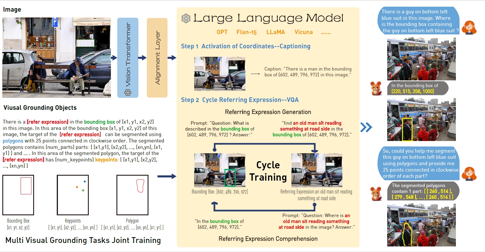

# Enhancing Visual Grounding and Generalization: A Multi-Task Cycle Training Approach for Vision-Language Models

This repository is a PyTorch implementation of the vision-language model for visual grounding proposed in *Enhancing Visual Grounding and Generalization: A Multi-Task Cycle Training Approach for Vision-Language Models* (submitted)




Visual grounding occupies a pivotal position in multi-modality vision-language models. However, current vision-language models concentrate on comprehending images, ignoring the human-computer interaction with multi-tasks instructions,  thereby imposing limitations on their versatility and depth of responses. In this study, we propose ViLaM, a large multi-modality model, that supports multi-tasks of visual grounding using the cycle training strategy, with abundant interaction instructions. The cycle training between referring expression generation (REG) and referring expression comprehension (REC) is introduced. It enhances the consistency between visual location and referring expressions, and addresses the need for high-quality, multi-tasks visual grounding datasets. Moreover, multi-tasks of visual grounding are promoted in our model, contributed by the cycle training strategy. The multi-tasks in REC encompass a range of granularities, from region-level to pixel-level, which include referring bbox detection, referring keypoints detection, and referring image segmentation. In REG, referring region classification determines the fine-grained category of the target, while referring region captioning generates a comprehensive description. Meanwhile, all tasks participate in the joint training, synergistically enhancing one another and collectively improving the overall performance of the model. Furthermore, leveraging the capabilities of large language models, ViLaM extends a wide range of instructions, thereby significantly enhancing its generalization and interaction potentials. It is particularly advantageous in domains beyond natural images, such as the medical field. Extensive public datasets corroborate the superior capabilities of our model in visual grounding with muti-tasks. Additionally, validating its robust generalization, ViLaM is validated under open-set and few-shot scenarios. Especially in the medical field, our model demonstrates cross-domain robust generalization capabilities. Furthermore, we contribute a visual grounding dataset, especially with multi-tasks. To support and encourage the community focused on visual grounding, we have made both the dataset and our code public: https://github.com/AnonymGiant/ViLaM.


The code in this repo is copied/modified from [BLIP2](https://github.com/salesforce/LAVIS).


## Installation

```bash
pip install -r requirements.txt
```

Meanwhile, you need to follow blip2's guidelines to download the datasets and checkpoints of large language models as the pre-trained model. 


## Experiments

Take vicuna7b as an example of training:

```bash
bash train-vicuna7b.sh
```

And, we provide test code for multiple GPUs:


```bash
bash predict.sh
```


## Results


### Accurate REC of Multi-Tasks

> Quantitatively, Table.4 presents a comparison of referring bbox detection results between our model and various types of visual grounding models, including specialized models and multi-tasks models. It clearly demonstrates that our method achieves SOTA performance across all test datasets. Notably, in the testB split of RefCOCO and RefCOCO+, our model outperforms other methods by a significant margin. This highlights the superiority of our approach in effectively handling the referring expression comprehension with bounding boxes, particularly for non-people objects.


> For referring bbox detection, Fig.3 illustrates the superiority of our method. It accurately identifies the object and understands its description words, such as position, color, and text on the object. Significantly, our model demonstrates the ability to recognize objects that are overlapping and occluded. When overlapping targets of the same class are present, our model reveals remarkable capabilities in understanding, discriminating, and locating them. This further corroborates that the cycle training effectively enhances the consistency between visual location and referring expressions.


> Besides, our model expands the competencies of visual grounding to pixel-level shown in Fig.4. Polygon is adopted to accurately delineate the objects denoted by referring expressions,  thereby significantly enhancing the alignment between the target shape and the referring expressions through the cycle training strategy.


